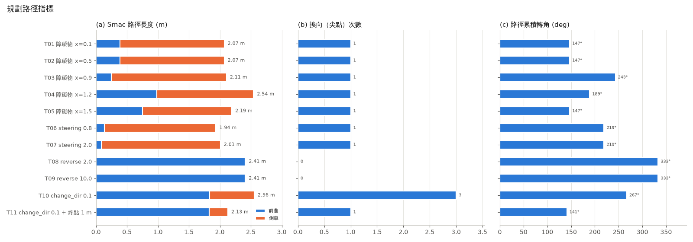
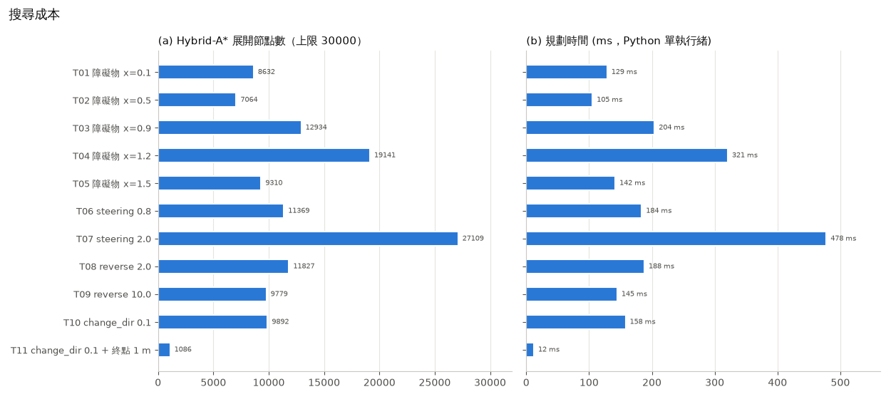
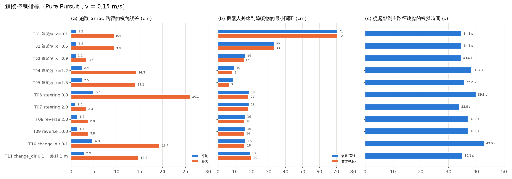
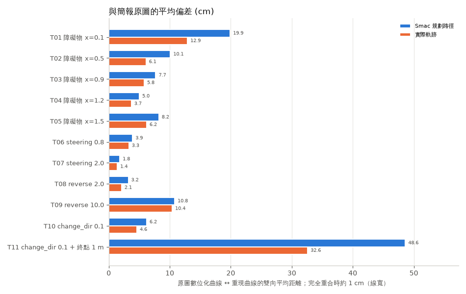
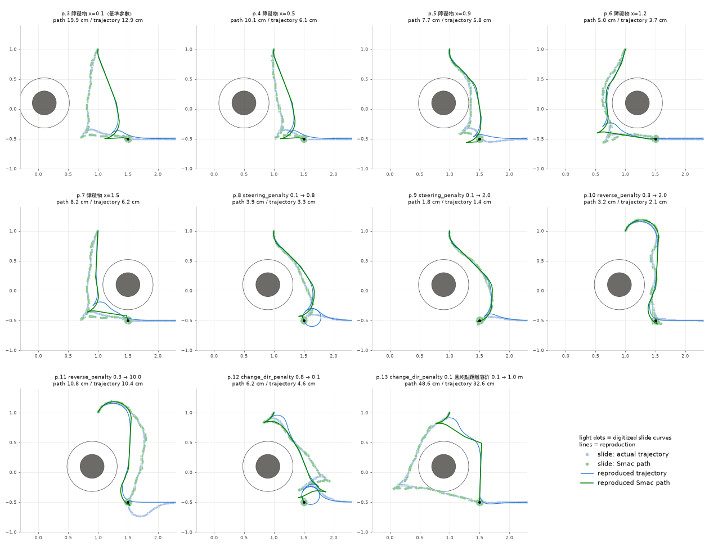
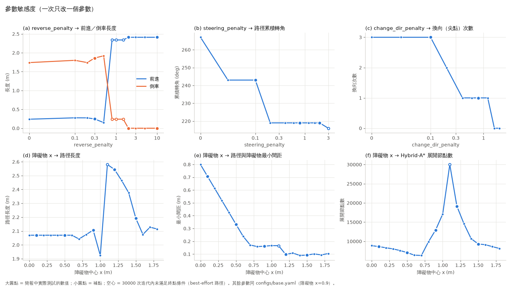

# 結果摘要

由 `scripts/make_report.py` 自動產生。

## 1. 各實驗指標（results/metrics.csv）

| 實驗 | 簡報 | 參數變化 | 達成終點 | 展開節點 | 規劃 ms | 路徑長 m (前進/倒車) | 換向 | 累積轉角° | 路徑最小間距 cm | 追蹤誤差 平均/最大 cm | 模擬 s |
|---|---|---|---|---|---|---|---|---|---|---|---|
| T01 障礙物 x=0.1 | p.3 | 障礙物 x=0.1（基準參數） | ✓ | 8632 | 129 | 2.07 (0.39/1.68) | 1 | 147 | 71 | 1.2/9.4 | 34.8 |
| T02 障礙物 x=0.5 | p.4 | 障礙物 x=0.5 | ✓ | 7064 | 105 | 2.07 (0.39/1.68) | 1 | 147 | 33 | 1.2/9.4 | 34.8 |
| T03 障礙物 x=0.9 | p.5 | 障礙物 x=0.9 | ✓ | 12934 | 204 | 2.11 (0.25/1.86) | 1 | 243 | 16 | 1.1/3.5 | 34.6 |
| T04 障礙物 x=1.2 | p.6 | 障礙物 x=1.2 | ✓ | 19141 | 321 | 2.54 (0.98/1.56) | 1 | 189 | 10 | 2.4/14.3 | 38.4 |
| T05 障礙物 x=1.5 | p.7 | 障礙物 x=1.5 | ✓ | 9310 | 142 | 2.19 (0.75/1.44) | 1 | 147 | 9 | 2.5/14.1 | 35.8 |
| T06 steering 0.8 | p.8 | steering_penalty 0.1 → 0.8 | ✓ | 11369 | 184 | 1.94 (0.14/1.80) | 1 | 219 | 18 | 5.0/26.1 | 39.9 |
| T07 steering 2.0 | p.9 | steering_penalty 0.1 → 2.0 | ✓ | 27109 | 478 | 2.01 (0.09/1.92) | 1 | 219 | 18 | 1.0/3.3 | 33.9 |
| T08 reverse 2.0 | p.10 | reverse_penalty 0.3 → 2.0 | ✓ | 11827 | 188 | 2.41 (2.41/0.00) | 0 | 333 | 16 | 1.4/3.8 | 37.0 |
| T09 reverse 10.0 | p.11 | reverse_penalty 0.3 → 10.0 | ✓ | 9779 | 145 | 2.41 (2.41/0.00) | 0 | 333 | 16 | 1.4/3.8 | 37.0 |
| T10 change_dir 0.1 | p.12 | change_dir_penalty 0.8 → 0.1 | ✓ | 9892 | 158 | 2.56 (1.84/0.72) | 3 | 267 | 16 | 4.8/19.4 | 42.9 |
| T11 change_dir 0.1 + 終點 1 m | p.13 | change_dir_penalty 0.1 且終點距離容許 0.1 → 1.0 m | ✓ | 1086 | 12 | 2.13 (1.83/0.30) | 1 | 141 | 19 | 2.9/14.8 | 35.1 |

- 追蹤誤差：實際軌跡到 Smac 路徑的橫向距離，只計 TRACKING_SMAC_SEGMENT 階段。
- 最小間距：機器人外緣（半徑 0.22 m）到障礙物表面的距離。

## 2. 與簡報原圖對照（results/reproduction_check.csv）

| 實驗 | 簡報 | 路徑偏差 平均/95% cm | 軌跡偏差 平均/95% cm | 換向 簡報/重現 | 抵達方式 簡報/重現 | 達成終點 簡報/重現 | 簡報路徑型態 |
|---|---|---|---|---|---|---|---|
| T01 障礙物 x=0.1 | p.3 | 19.9 / 47.7 | 12.9 / 45.3 | 1 / 1 | forward / forward | ✓ / ✓ | 起點左偏倒車直下，左下方換向後前進接入 |
| T02 障礙物 x=0.5 | p.4 | 10.1 / 22.1 | 6.1 / 20.9 | 1 / 1 | forward / forward | ✓ / ✓ | 貼著障礙物右側倒車直下，底部換向後前進 |
| T03 障礙物 x=0.9 | p.5 | 7.7 / 19.2 | 5.8 / 19.6 | 1 / 1 | forward / forward | ✓ / ✓ | 先右轉繞到障礙物右側倒車下降，入口左側換向後前進 |
| T04 障礙物 x=1.2 | p.6 | 5.0 / 13.2 | 3.7 / 13.6 | 1 / 1 | forward / forward | ✓ / ✓ | 由障礙物左側倒車下降，左下方換向後前進 |
| T05 障礙物 x=1.5 | p.7 | 8.2 / 17.1 | 6.2 / 17.4 | 1 / 1 | forward / forward | ✓ / ✓ | 與 p.3 相同（障礙物未擋到路線） |
| T06 steering 0.8 | p.8 | 3.9 / 10.5 | 3.3 / 10.1 | 0 / 1 | reverse / forward | ✓ / ✓ | 繞障礙物右側一路倒車，由右上方倒車進入 |
| T07 steering 2.0 | p.9 | 1.8 / 5.0 | 1.4 / 4.6 | 0 / 1 | reverse / forward | ✓ / ✓ | 同 p.8 但更平滑，終點略越過入口 |
| T08 reverse 2.0 | p.10 | 3.2 / 10.1 | 2.1 / 7.6 | 0 / 0 | forward / forward | ✓ / ✓ | 全程前進，先上方右迴轉再往下接入口 |
| T09 reverse 10.0 | p.11 | 10.8 / 24.7 | 10.4 / 23.2 | 0 / 0 | forward / forward | ✗ / ✓ | 全程前進，迴轉幅度較大，抵達入口時車頭朝下（未滿足角度條件） |
| T10 change_dir 0.1 | p.12 | 6.2 / 17.5 | 4.6 / 16.4 | 2 / 3 | reverse / forward | ✗ / ✓ | 起點短倒車後前進斜下，再倒車；終點距入口約 0.23 m |
| T11 change_dir 0.1 + 終點 1 m | p.13 | 48.6 / 123.5 | 32.6 / 124.9 | 1 / 1 | forward / forward | ✓ / ✓ | 倒車繞障礙物左側到最左下，換向前進後以約 1 m 直線解析擴展接入 |

- 偏差：原圖數位化像素與重現曲線的雙向平均距離；線寬約 3 cm，完全重合時約 1 cm。
- 簡報欄位（換向、抵達方式、是否達成終點）由原圖人工判讀，定義見 `reference/slide_annotations.yaml`。

## 3. 參數敏感度（results/sensitivity.csv）

